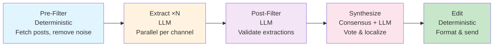

<p align="center">
  
</p>

Israeli Home Front Command alerts — delivered to your loved ones' Telegram chat.

[](LICENSE)
[](https://www.npmjs.com/package/easyoref)
[](https://langchain-ai.github.io/langgraphjs/)
[](https://www.typescriptlang.org/)

[עברית](docs/readme_he.md) · [Русский](docs/readme_ru.md)

> [!CAUTION]
> EasyOref **does not replace** official Home Front Command alerts.
> It **supplements** them — keeping your loved ones abroad informed.
> Always follow Home Front Command instructions!

## Why

During a rocket attack, your loved ones abroad see "MISSILES HIT TEL AVIV" on news.

They don't know:

- Is it your neighborhood or 200 km away?
- Are you safe?
- Should they worry?

**Nothing solves this for them today.**
Alert apps with area filtering — for you in Israel.
Cell Broadcast alerts — for you in Israel.

## Features

- **4 languages** — Russian, English, Hebrew, Arabic
- **3 alert types** — early warning, red_alert, all-clear
- **AI enrichment** — LangGraph pipeline scrapes Telegram news channels and enriches alerts with attack type, ETA, source citations
- **Shelter search** — send your location, get nearest shelters with walking time
- **Q&A chat** — ask the bot about the current situation in natural language
- **Inline mode** — type `@easyorefbot` in any chat for live alert status
- **Freemium tiers** — free alerts for everyone, pro features for power users
- **Custom messages** — your own text and media per alert type

## Quick Start

### Install

#### 1. Install Node.js

<details>
<summary>Windows</summary>

Download from [nodejs.org](https://nodejs.org/) (LTS, 22+). Run installer, click "Next".

</details>

<details>
<summary>macOS</summary>

```bash
brew install node
```

Or download from [nodejs.org](https://nodejs.org/).

</details>

<details>
<summary>Linux / Raspberry Pi</summary>

```bash
curl -fsSL https://deb.nodesource.com/setup_22.x | sudo -E bash -
sudo apt install -y nodejs
```

</details>

#### 2. Set up Telegram

1. Message [@BotFather](https://t.me/BotFather) → `/newbot` → copy the **token**
2. Add bot to your Telegram chat
3. Forward any message to [@userinfobot](https://t.me/userinfobot) → copy the **chat ID**

#### 3. Find your city ID

Open [cities.json](https://github.com/eladnava/pikud-haoref-api/blob/master/cities.json), find your city, copy the `id`.

Example: `"id": 722` = Tel Aviv — South & Jaffa.

#### 4. Install & Configure

```bash
npm install -g easyoref@latest
easyoref init
```

The wizard prompts for: language, bot_token, chat_id, city_ids. Config saved to `~/.easyoref/config.yaml`.

#### 5. Install as Service (Recommended for 24/7)

```bash
sudo HOME=$HOME easyoref install
systemctl status easyoref
```

**Done!** Bot runs 24/7 via systemd. Logs: `easyoref logs`

> Guides: [RPi](docs/rpi.md) · [Local](docs/local.md)

### Update

To update the deployed instance, run:

```bash
easyoref update
```

## How it works

EasyOref runs two layers:

**Core layer** — always on, <1s latency

- Polls Pikud HaOref API every 2 seconds
- Filters alerts by city ID (Iron Dome zone-aware)
- Delivers to Telegram instantly

**Agentic enrichment layer** — LangGraph pipeline per alert



| Node                                                                     | Description                                                                                                       |
| ------------------------------------------------------------------------ | ----------------------------------------------------------------------------------------------------------------- |
|  **Pre-Filter**  | Collects Telegram channel posts from Redis, applies noise filters and watermark tracking                          |
|  **Extract**     | Parallel fan-out: one LLM call per channel extracts structured data (origin, ETA, rocket type, intercepts)        |
|  **Post-Filter** | Validates each insight against source text — filters hallucinations, soft-passes critical phases                  |
|  **Synthesize**  | Deterministic consensus voting (0 tokens) + LLM synthesis for localized display (ru/en/he/ar). Applies guardrails |
|  **Edit**        | Builds enriched message with superscript citations and edits the Telegram post in-place                           |

BullMQ worker manages enrichment runs per alert session (config-driven max runs). `ai.enabled: false` disables enrichment entirely — core delivery continues with zero LLM dependency.

## Configuration

Config file: `~/.easyoref/config.yaml`. Created by `npx easyoref init`.

Full reference: [`config.yaml.example`](config.yaml.example).

| Key                      | Default | Description                                                                                         |
| ------------------------ | ------- | --------------------------------------------------------------------------------------------------- |
| `city_ids`               | —       | **required.** [Find city IDs](https://github.com/eladnava/pikud-haoref-api/blob/master/cities.json) |
| `telegram.bot_token`     | —       | **required.** Token from @BotFather                                                                 |
| `telegram.chat_id`       | —       | **required.** Chat ID (negative number)                                                             |
| `language`               | `ru`    | `ru` `en` `he` `ar`                                                                                 |
| `alert_types`            | all     | `early` `red_alert` `resolved`                                                                      |
| `gif_mode`               | `none`  | `funny_cats` `none`                                                                                 |
| `admin_chat_ids`         | —       | Telegram user IDs for `/grant`, `/revoke`, `/users` admin commands                                  |
| `ai.enabled`             | `false` | Enable LangGraph enrichment pipeline                                                                |
| `ai.openrouter_api_key`  | —       | [OpenRouter](https://openrouter.ai) API key for LLM calls                                           |
| `ai.redis_url`           | —       | Redis URL for BullMQ + GramJS post storage                                                          |
| `title_override.*`       | —       | Custom title per alert type                                                                         |
| `description_override.*` | —       | Custom description per alert type                                                                   |

## Development

### Workflow

```bash
# Test
npm test              # Run all tests
npm run test:watch   # Watch mode

# Build
npm run build        # Build all packages

# Local development
npm run dev          # Run bot locally (with hot reload)

# Release (all-in-one: bump + tag + push + publish + deploy)
npm run release       # Patch: 1.21.0 → 1.21.1
npm run release:minor # Minor: 1.21.0 → 1.22.0
npm run release:major # Major: 1.21.0 → 2.0.0
```

**What `npm run release` does:**

1. Bumps all 6 package versions
2. Creates git commit: `chore: bump to easyoref@X.Y.Z, ...`
3. Creates git tag: `vX.Y.Z`
4. Pushes commit + tag to remote
5. Builds all packages
6. Publishes to npm
7. Triggers RPi update (if reachable)

See [AGENTS.md](AGENTS.md) for full deployment architecture.

## License

[MIT](LICENSE) — Mikhail Kogan, 2026
